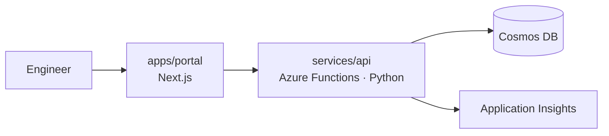

# Architecture

## Philosophy

The platform evolves. Never over-engineer. Prefer Azure managed services.

Every service eventually has:

- A `/health` endpoint
- Structured logs
- Metrics
- CI/CD
- A Dockerfile

And eventually (only when justified):

- Kubernetes
- GitOps
- OpenTelemetry
- Service mesh

## Evolution path

### Phase 0 — 10 users
```
One Next.js app  →  One Azure Function (Python)  →  One Cosmos DB
```
Simplicity over everything. Single region. No auth yet.

### Phase 1 — 100 users
```
Developer Portal → Authentication (Entra ID) → AI Assistant (RAG)
```

### Phase 2 — 10,000 users
```
Telemetry → Notifications → Search → Documentation
```

### Phase 3 — 100,000 users
```
Containers → GitHub Actions → Container Registry → Container Apps
```

### Phase 4 — millions of users
```
AKS → GitOps → Observability → Service Mesh
```

## Topology (Phase 0)



## Boundaries

- `apps/*` — user-facing applications (portal, docs, playground). No business logic
  that belongs to a platform capability.
- `services/*` — platform capabilities (api, auth, ai, notifications, telemetry).
  Each is independently deployable and owns its data.
- `packages/*` — shared TypeScript/Python libraries (types, clients, UI).
- `infrastructure/*` — bicep, docker, github-actions, kubernetes.
