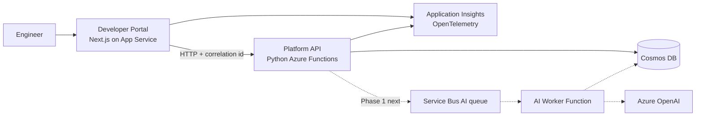

# Nimbus Project Context

> Start here when joining Nimbus with no prior chat history. This file is the stable map;
> detailed decisions remain authoritative in the linked brain docs and ADRs.

## Vision

Nimbus is a miniature cloud platform, not a collection of demos. Every application is a
tenant or capability of the platform. The project demonstrates how an Azure-native platform
evolves from 10 users to 10 million users while applying distributed-systems lessons from
DDIA. See [vision.md](./vision.md).

## Current phase

**Phase 1 (100 users) is in progress.** Phase 0 is complete and deployed to Azure.

Completed:

- Developer Portal on Next.js / Azure App Service.
- Python Azure Functions Platform API with health and Learning Journal endpoints.
- Cosmos DB with managed-identity, keyless access.
- GitHub Actions deployment through OIDC, path filters, and smoke tests.
- Entra ID / EasyAuth identity model and policy-based authorization in the portal.
- Application Insights + OpenTelemetry, structured logs, and correlation IDs.

Current goal:

- Build the asynchronous AI Assistant described by ADR-0006: API acceptance, Service Bus
  queue, Function worker, Cosmos response store, and portal polling.

Read [current-state.md](./current-state.md) for live status and
[handoff.md](./handoff.md) for the active work item.

## Platform constitution

- Evolve, never rewrite.
- Prefer Azure managed services and managed identity.
- Add technology only when traffic, cost, reliability, or ownership creates pressure.
- Build for the current phase and document the path to 10 million users.
- Make every service production-shaped: health, structured logs, and a clear contract.
- Isolate failure domains and degrade gracefully.
- Preserve durable intent across downstream failure.
- Optimize for the common case; add targeted spill strategies for tail cases.
- Keep identity, authorization, and data partitioning separate.
- Build versioned capabilities for consumers, not one-off pages.

The canonical wording is in [platform-principles.md](./platform-principles.md).

## Technology stack

| Concern | Current choice |
|---------|----------------|
| Portal | Next.js App Router, TypeScript, Tailwind CSS |
| Backend | Python 3.11, Azure Functions v2 programming model |
| Data | Cosmos DB serverless |
| Identity | Microsoft Entra ID + App Service EasyAuth |
| Observability | Application Insights + Azure Monitor OpenTelemetry |
| CI/CD | GitHub Actions + keyless Azure OIDC |
| Hosting | Azure App Service (portal) + Functions Consumption (API) |
| Infrastructure | Bicep as Azure IaC is introduced |

See [tech-stack.md](./tech-stack.md) for rationale and version policy.

## Current architecture

Solid lines are deployed. Dotted lines are the active Phase 1 build.

## Scaling roadmap

| Scale | Pressure / capability | Evolution |
|-------|-----------------------|-----------|
| 10 | Platform foundation | Portal -> API -> Cosmos, single region |
| 100 | Slow, bursty AI + identity | Entra ID; async AI on Functions + Service Bus |
| 1,000 | Repeated prompts and cost | Redis semantic cache, rate limits, token budgets |
| 10,000 | Retrieval quality and query load | Azure AI Search, notifications, docs, Platform Bus when triggered |
| 100,000 | Runtime and independent-scaling needs | Container Apps, ACR, Front Door/CDN, repartitioning |
| 1,000,000 | Regional latency and governance | Multi-region reads, APIM AI gateway |
| 10,000,000 | Orchestration becomes simpler than alternatives | AKS, GitOps, active-active only with written triggers |

The canonical trigger-based roadmap is [../docs/scaling.md](../docs/scaling.md).

## ADR index

| ADR | Decision | Status |
|-----|----------|--------|
| [0001](../docs/adr/0001-monorepo-and-evolution.md) | Monorepo; evolve rather than rewrite | Accepted |
| [0002](../docs/adr/0002-python-backend.md) | Python for platform services | Accepted |
| [0003](../docs/adr/0003-app-service-hosting.md) | App Service for the portal, for now | Accepted |
| [0004](../docs/adr/0004-managed-identity-everywhere.md) | Managed identity and zero stored Azure credentials | Accepted |
| [0005](../docs/adr/0005-cosmos-partition-key.md) | Phase 0 Cosmos partition strategy | Accepted; revisit on growth |
| [0006](../docs/adr/0006-async-ai-requests.md) | Asynchronous AI requests on Functions | Accepted |
| [0007](../docs/adr/0007-keyless-cicd-oidc.md) | Keyless GitHub OIDC CI/CD | Accepted |
| [0008](../docs/adr/0008-platform-bus.md) | Event-driven Platform Bus | Proposed; wait for trigger |
| [0009](../docs/adr/0009-identity-platform.md) | Authentication as an identity platform | Accepted |
| [0010](../docs/adr/0010-observability.md) | Observability foundation before AI | Accepted |

## Never suggest by default

- Kubernetes, a service mesh, event sourcing, or microservices without a written trigger.
- Portal access directly to Cosmos DB or Azure OpenAI.
- Long-lived credentials, Cosmos keys, publish profiles, or secrets in GitHub.
- A rewrite when the existing design can evolve through migration.
- Containers merely to isolate AI; Functions already scale independently in this phase.
- A shared database as an integration contract between future services.

## How the agent should reason

Act as Nimbus's principal engineer. For every architectural suggestion answer:

1. Why does this exist?
2. What concrete problem does it solve?
3. Why is it needed in the current phase?
4. What tradeoff does it introduce?
5. What breaks or changes at 10 million users?

Prefer extending existing boundaries over introducing a new component. Read
[principal-engineer.md](./principal-engineer.md) for the full reasoning posture.

## Reading order

1. This file for orientation.
2. [current-state.md](./current-state.md) for durable status.
3. [handoff.md](./handoff.md) for branch, active task, and immediate next action.
4. [roadmap.md](./roadmap.md) and [architecture.md](./architecture.md) for phase boundaries.
5. Relevant ADRs and [../docs/engineering-journal.md](../docs/engineering-journal.md)
   before changing architecture.